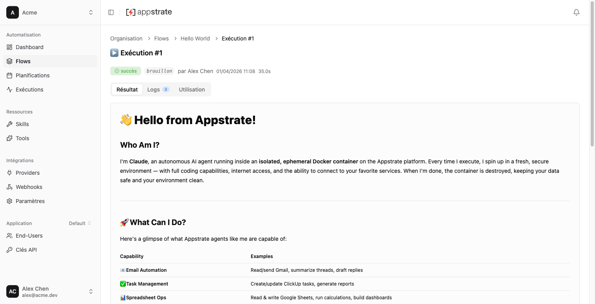

# Appstrate

[](https://github.com/appstrate/appstrate/actions/workflows/test.yml)
[](./LICENSE)
[](https://github.com/appstrate/appstrate/pkgs/container/appstrate)
[](CODE_OF_CONDUCT.md)
[](https://discord.gg/5Js2CKWNnh)

An open-source platform for running autonomous AI agents in sandboxed Docker containers. Each agent receives its full context (prompt, config, input, credentials) and runs to completion without human interaction — then returns structured results. Connect OAuth/API key services, click "Run" or schedule via cron, and let the AI handle the rest.




## Concepts

Appstrate uses the [AFPS](https://github.com/appstrate/afps-spec) (Agent Format Packaging Standard) packaging model. Everything is a **package** with a manifest, a version, and a scope.

```
                ┌───────────────────────────────┐
  Goal          │  Agent                        │  "What should the AI accomplish?"
                │  prompt.md + manifest.json    │  Runs autonomously in a container.
                ├───────────────────────────────┤
  Capability    │  Skill (declarative)          │  Reusable instructions (SKILL.md).
                │  Tool  (executable)           │  TypeScript code the agent can call.
                ├───────────────────────────────┤
  Connection    │  Provider                     │  OAuth2, API key, or custom auth
                │                               │  for external services.
                └───────────────────────────────┘
```

- An **agent** is the primary unit. It declares a goal (`prompt.md`), its dependencies (skills, tools, providers), and input/output/config schemas. Each run creates a fresh Docker container, injects the prompt and credentials via a sidecar proxy, and produces a structured result.
- A **skill** adds knowledge — reusable instructions the agent follows during a run (compatible with the [Agent Skills](https://agentskills.io/) format).
- A **tool** adds capability — executable TypeScript code the agent can invoke at runtime.
- A **provider** adds connectivity — authentication metadata for external services (Gmail, ClickUp, Stripe, etc.). Users connect once; credentials are encrypted and injected via the sidecar.

Agents are **prompt-driven**: the AI coding agent inside the container interprets the goal and writes its own execution code. Change the prompt, change the behavior — no node graphs, no pre-scripted steps.

## Features

- **Autonomous AI agents** — Each run executes in an isolated Docker container with a Pi Coding Agent
- **OAuth2 + API key connections** — Connect external services (OAuth2/PKCE, OAuth 1.0a, API key, basic auth, custom credentials)
- **Sandboxed runs** — Containers are created, run, and destroyed per run
- **Sidecar isolation** — Credential injection via a sidecar proxy (agent never sees raw credentials)
- **Cron scheduling** — Schedule agents with cron expressions, distributed lock prevents duplicates
- **Package import** — Import agents, skills, extensions, and providers from ZIP/AFPS files
- **Skills & extensions** — Extend agent capabilities with SKILL.md instructions and TypeScript tool extensions
- **Realtime** — SSE-based run monitoring with LISTEN/NOTIFY
- **Multi-tenant** — Organization-based isolation with role-based access (owner/admin/member)
- **API keys** — Programmatic access via `ask_*` prefixed API keys
- **OpenAPI documentation** — 191 endpoints documented at `/api/openapi.json` + Swagger UI at `/api/docs`
- **Connection profiles** — Share connection sets across agents
- **Proxy system** — Org-level and agent-level outbound HTTP proxy support

## Self-Hosting

Deploy Appstrate with a single command. The installer downloads the `appstrate` CLI and prompts for a [tier](#progressive-infrastructure) — from a zero-dependency Bun-only install (Tier 0) to a full PostgreSQL + Redis + MinIO production stack (Tier 3).

```sh
curl -fsSL https://get.appstrate.dev | bash
```

Once a tier is chosen, the CLI generates cryptographic secrets, writes `.env` + `docker-compose.yml` (Tiers 1/2/3) or clones the source + spawns `bun run dev` (Tier 0), waits for the healthcheck, and opens [http://localhost:3000](http://localhost:3000). Non-interactive: `curl ... | bash -s -- --tier 3 --dir ~/appstrate`.

See [`apps/cli/README.md`](./apps/cli/README.md) for the full CLI reference, and [`examples/self-hosting/`](./examples/self-hosting/) for manual Docker Compose setup.

## Quick Start (Development)

Prerequisites: [Bun](https://bun.sh/) (v1.3+). Docker is optional.

```sh
git clone https://github.com/appstrate/appstrate.git
cd appstrate
bun install
cp .env.example .env
bun run dev       # → http://localhost:3000
```

No Docker, no PostgreSQL, no Redis — just Bun. Appstrate uses **progressive infrastructure**: it starts with an embedded database (PGlite) and local storage, then scales up to PostgreSQL, Redis, and S3 as you need them.

After signup, the onboarding flow guides you to create your first organization. See [Contributing](./CONTRIBUTING.md) for the full development guide.

### Progressive Infrastructure

Appstrate adapts to your infrastructure. Start minimal and add services as you grow — each tier works both as a development setup and a deployment target for small to medium workloads.

| Tier  | Name            | Prerequisites | Database                | Storage    | Queue     | Execution         | RAM (idle) | RAM per run |
| ----- | --------------- | ------------- | ----------------------- | ---------- | --------- | ----------------- | ---------- | ----------- |
| **0** | **Embedded**    | Bun           | PGlite (embedded)       | Filesystem | In-memory | Bun subprocess    | ~300 MB    | +50-100 MB  |
| **1** | **Lightweight** | Bun + Docker  | PostgreSQL              | Filesystem | In-memory | Bun subprocess    | ~600 MB    | +50-100 MB  |
| **2** | **Persistent**  | Bun + Docker  | PostgreSQL + Redis      | Filesystem | BullMQ    | Bun subprocess    | ~700 MB    | +50-100 MB  |
| **3** | **Full**        | Bun + Docker  | PostgreSQL + Redis + S3 | S3         | BullMQ    | Docker containers | ~1.5 GB    | +200-300 MB |

Tiers 0-2 run agents as Bun subprocesses — each concurrent run adds ~50-100 MB. On constrained hardware, limit parallel runs accordingly.

**Tier 0** is ideal for personal use, small devices (Raspberry Pi 4+, NAS), or getting started with zero dependencies. **Tiers 1-2** suit small teams and constrained servers. **Tier 3** is for production with full container isolation.

> **Raspberry Pi**: Bun supports ARM64 natively. A Raspberry Pi 4 (4 GB) handles Tiers 0-1 with 2-3 concurrent runs. A Pi 5 (8 GB) can run Tier 2 comfortably or Tier 3 with `SIDECAR_POOL_SIZE=0` and sequential runs.

**Tier 0** is the default — `bun run dev` works immediately after install. To scale up:

```sh
# Tier 1: add PostgreSQL (persistent data, multi-user)
bun run docker:dev:minimal    # starts PostgreSQL
# → uncomment DATABASE_URL in .env

# Tier 2: add Redis (persistent scheduling, multi-instance)
bun run docker:dev:standard   # starts PostgreSQL + Redis
# → uncomment DATABASE_URL + REDIS_URL in .env

# Tier 3: full production stack
bun run docker:dev            # starts PostgreSQL + Redis + MinIO
# → uncomment DATABASE_URL + REDIS_URL + S3_BUCKET in .env
```

<details>
<summary>Full setup with Docker (Tier 3)</summary>

```sh
bun install
bun run setup     # copies .env, starts all Docker services, runs migrations, builds frontend
bun run dev       # → http://localhost:3000
```

</details>

## Project Structure

```
appstrate/
├── apps/
│   ├── api/src/              # Hono API server (:3000)
│   │   ├── routes/           # Route handlers (one file per domain)
│   │   ├── services/         # Business logic, Docker, adapters, scheduler, marketplace
│   │   ├── openapi/          # OpenAPI 3.1 spec (191 endpoints)
│   │   └── middleware/       # Auth, rate-limit, guards (requireAdmin, requireAgent)
│   │
│   └── web/src/              # React 19 SPA (Vite + React Query v5 + Zustand)
│       ├── pages/            # Route pages (React Router v7)
│       ├── hooks/            # React Query + SSE realtime hooks
│       ├── components/       # UI components (modals, forms, editors)
│       └── stores/           # Zustand stores (auth, org, app, sidebar, theme)
│
├── packages/
│   ├── core/                 # @appstrate/core — shared validation, storage, utilities
│   ├── db/                   # @appstrate/db — Drizzle ORM (31 tables, 5 enums) + Better Auth
│   ├── env/                  # @appstrate/env — Zod env validation
│   ├── shared-types/         # @appstrate/shared-types — Drizzle InferSelectModel re-exports
│   └── connect/              # @appstrate/connect — OAuth2/PKCE, API key, credential encryption
│
├── system-packages/           # System package ZIPs (providers, skills, extensions, agents — loaded at boot)
│
├── runtime-pi/               # Docker image: Pi Coding Agent SDK
│   ├── entrypoint.ts         # SDK session → JSON lines on stdout
│   └── sidecar/server.ts     # Credential-isolating HTTP proxy
│
└── scripts/verify-openapi.ts # OpenAPI validation (coverage + structure + lint)
```

## API Overview

The API is organized into 25 route domains with 191 documented endpoints:

| Domain                  | Description                                                                                             |
| ----------------------- | ------------------------------------------------------------------------------------------------------- |
| **Auth**                | Better Auth email/password + cookie sessions                                                            |
| **Agents**              | Agent CRUD, config, skills/extensions binding, versions                                                 |
| **Runs**                | Run agents, list runs, logs, cancel                                                                     |
| **Realtime**            | SSE streams for run monitoring                                                                          |
| **Schedules**           | Cron-based agent scheduling                                                                             |
| **Connections**         | OAuth2/API key service connections                                                                      |
| **Connection Profiles** | Shared connection sets across agents                                                                    |
| **Providers**           | Provider package configuration (OAuth2, API key, custom)                                                |
| **Provider Keys**       | Org-level LLM provider API key management                                                               |
| **Proxies**             | Org-level and agent-level HTTP proxy config                                                             |
| **API Keys**            | Programmatic access tokens (`ask_*`)                                                                    |
| **Packages**            | Organization skills/extensions CRUD, import, publish                                                    |
| **Notifications**       | Run notification management                                                                             |
| **Organizations**       | Org CRUD, members, invitations                                                                          |
| **Profile**             | User profile management                                                                                 |
| **Invitations**         | Magic link invitation acceptance                                                                        |
| **Welcome**             | Post-invite profile setup                                                                               |
| **Internal**            | Container-to-host routes (credentials, run history)                                                     |
| **Meta**                | OpenAPI spec + Swagger UI                                                                               |
| **Models**              | Org-level LLM model configuration and testing                                                           |
| **Health**              | Health check                                                                                            |
| **Applications**        | Primary workspace boundary — scopes agents, runs, schedules, webhooks, connections, packages, end-users |
| **App Profiles**        | Application-scoped connection profile management                                                        |
| **End-Users**           | External end-user management for headless API                                                           |
| **Webhooks**            | Run event webhooks with HMAC signing                                                                    |

### API Documentation

- **Interactive docs**: `GET /api/docs` — Swagger UI, try endpoints in your browser
- **OpenAPI spec**: `GET /api/openapi.json` — Raw OpenAPI 3.1 specification
- **Validation**: `bun run verify:openapi` — Structural + lint checks (0 errors/warnings required)

## Architecture

```
Browser (React SPA)              Platform (Bun + Hono :3000)
    |                                |
    |-- Login/Signup --------------->|-- Better Auth (cookie session)
    |-- POST /api/agents/:id/run ->|
    |                                |-- Validate → Create run → Fire-and-forget
    |<-- SSE (realtime) ------------|-- LISTEN/NOTIFY → SSE stream
    |                                |
    |   Docker network (isolated):   |
    |   ┌─────────────────────┐      |
    |   │  Sidecar Container  │      │-- Credential injection proxy
    |   │  Agent Container    │      │-- Pi SDK → JSON lines stdout
    |   └─────────────────────┘      |
```

- **Sidecar pool**: Pre-warmed containers for fast startup
- **Parallel setup**: Sidecar + agent creation run concurrently
- **Credential isolation**: Agent calls sidecar proxy; never sees raw credentials
- **Output validation**: Native LLM schema enforcement + AJV post-validation against output schema

## Environment Variables

All variables are listed in `.env.example` with dev-ready defaults. The authoritative validation source is `packages/env/src/index.ts` (Zod schema).

| Variable                    | Required | Default                                       | Description                                                        |
| --------------------------- | -------- | --------------------------------------------- | ------------------------------------------------------------------ |
| `DATABASE_URL`              | No       | —                                             | PostgreSQL connection. Absent = PGlite (embedded)                  |
| `BETTER_AUTH_SECRET`        | Yes      | —                                             | Session signing secret                                             |
| `CONNECTION_ENCRYPTION_KEY` | Yes      | —                                             | 32 bytes base64, encrypts stored credentials                       |
| `REDIS_URL`                 | No       | —                                             | Redis connection. Absent = in-memory adapters (single-instance)    |
| `S3_BUCKET`                 | No       | —                                             | S3 bucket. Absent = filesystem storage (`FS_STORAGE_PATH`)         |
| `S3_REGION`                 | No       | —                                             | S3 region. Required when `S3_BUCKET` is set                        |
| `FS_STORAGE_PATH`           | No       | `./data/storage`                              | Filesystem storage path (used when `S3_BUCKET` is absent)          |
| `PGLITE_DATA_DIR`           | No       | `./data/pglite`                               | PGlite data directory (used when `DATABASE_URL` is absent)         |
| `RUN_TOKEN_SECRET`          | No       | —                                             | Run token signing secret                                           |
| `APP_URL`                   | No       | `http://localhost:3000`                       | Public URL for OAuth callbacks                                     |
| `TRUSTED_ORIGINS`           | No       | `http://localhost:3000,http://localhost:5173` | CORS origins (comma-separated)                                     |
| `PORT`                      | No       | `3000`                                        | Server port                                                        |
| `DOCKER_SOCKET`             | No       | `/var/run/docker.sock`                        | Docker socket path                                                 |
| `PLATFORM_API_URL`          | No       | —                                             | How sidecar reaches host (fallback: `host.docker.internal:{PORT}`) |
| `SYSTEM_PROVIDER_KEYS`      | No       | `[]`                                          | JSON array of system provider keys with nested models              |
| `SYSTEM_PROXIES`            | No       | `[]`                                          | JSON array of system proxy definitions                             |
| `PROXY_URL`                 | No       | —                                             | Outbound HTTP proxy for sidecar containers                         |
| `LOG_LEVEL`                 | No       | `info`                                        | `debug` \| `info` \| `warn` \| `error`                             |
| `RUN_ADAPTER`               | No       | `process`                                     | Execution backend: `docker` or `process`                           |
| `SIDECAR_POOL_SIZE`         | No       | `2`                                           | Pre-warmed sidecar containers (0 = disabled)                       |
| `S3_ENDPOINT`               | No       | —                                             | Custom S3 endpoint (for MinIO/R2)                                  |
| `PI_IMAGE`                  | No       | `appstrate-pi:latest`                         | Docker image for the Pi agent runtime                              |
| `SIDECAR_IMAGE`             | No       | `appstrate-sidecar:latest`                    | Docker image for the sidecar proxy                                 |
| `COOKIE_DOMAIN`             | No       | —                                             | Cookie domain for cross-subdomain auth                             |
| `GOOGLE_CLIENT_ID`          | No       | —                                             | Google OAuth client ID (enables Google sign-in)                    |
| `GOOGLE_CLIENT_SECRET`      | No       | —                                             | Google OAuth client secret                                         |
| `GITHUB_CLIENT_ID`          | No       | —                                             | GitHub OAuth App client ID (enables GitHub sign-in)                |
| `GITHUB_CLIENT_SECRET`      | No       | —                                             | GitHub OAuth App client secret                                     |
| `SMTP_HOST`                 | No       | —                                             | SMTP server host (enables email verification)                      |
| `SMTP_PORT`                 | No       | `587`                                         | SMTP server port                                                   |
| `SMTP_USER`                 | No       | —                                             | SMTP authentication username                                       |
| `SMTP_PASS`                 | No       | —                                             | SMTP authentication password                                       |
| `SMTP_FROM`                 | No       | —                                             | Sender email address for verification emails                       |

## Development

```sh
bun run setup            # One-command dev bootstrap (first time only)
bun run dev              # Start API + web (turbo, hot-reload)
bun run check            # TypeScript + ESLint + Prettier + OpenAPI validation
bun test                 # All tests (~1000) — requires Docker
bun run db:generate      # Generate Drizzle migrations from schema changes
bun run db:migrate       # Apply migrations
bun run build            # Build everything (turbo)
bun run build-runtime    # Build agent Docker image (only if you modify runtime-pi/)
bun run build-sidecar    # Build sidecar Docker image (only if you modify runtime-pi/sidecar/)
```

### Testing

```sh
bun test                          # All tests (~1000), all packages — requires Docker
bun test apps/api/test/unit/      # API unit tests only (fast, no DB)
bun test apps/api/test/           # API unit + integration
bun test runtime-pi/              # Runtime + sidecar tests
```

Test infrastructure (PostgreSQL, Redis, MinIO, DinD) is started automatically by the preload script on first run. Framework: `bun:test`. See `CLAUDE.md` Testing section for conventions and patterns.

## Tech Stack

- **Runtime**: Bun
- **API**: Hono (SSE, middleware, routing)
- **Database**: PostgreSQL 16 + Drizzle ORM
- **Auth**: Better Auth (cookie sessions) + API keys (`ask_*`)
- **Frontend**: React 19 + Vite + React Router v7 + React Query v5 + Zustand
- **Styling**: Tailwind CSS 4 (`@tailwindcss/vite` plugin + `tailwind-merge`, dark theme via `@theme inline`)
- **i18n**: i18next (fr default, en)
- **Docker**: fetch() + unix socket (not dockerode)
- **Scheduling**: BullMQ (Redis-backed distributed cron) + cron-parser
- **Validation**: AJV (config/input/output), Zod (env), `@appstrate/core` (manifests)
- **Build**: Turborepo + Bun workspaces
- **Code quality**: ESLint + Prettier + OpenAPI lint (`@redocly/openapi-core`)

## FAQ

**Can I self-host Appstrate?**
Yes. Run `curl -fsSL https://get.appstrate.dev | bash` to install with automatic secret generation and Docker Compose setup. See [Self-Hosting](#self-hosting) and [`examples/self-hosting/`](./examples/self-hosting/) for configuration.

**What LLM providers are supported?**
Any provider compatible with the Pi Coding Agent SDK. Configure via `SYSTEM_PROVIDER_KEYS` or the org-level model settings UI.

**How is this different from workflow automation tools?**
Appstrate runs autonomous AI agents in isolated containers, not predefined step-by-step workflows. Each agent is prompt-driven — the agent decides how to process data.

**Is this production-ready?**
The platform is actively used in production. See [SECURITY.md](./SECURITY.md) for the threat model and defense layers, and [CHANGELOG.md](./CHANGELOG.md) for release history.

## Community

- 💬 [Discord](https://discord.gg/5Js2CKWNnh) — chat, questions, showcase what you're building
- 💡 [GitHub Discussions](https://github.com/appstrate/appstrate/discussions) — long-form Q&A and proposals
- 🐛 [GitHub Issues](https://github.com/appstrate/appstrate/issues) — bugs and feature requests

## Support

- **Bug reports**: [GitHub Issues](https://github.com/appstrate/appstrate/issues)
- **Questions**: [Discord](https://discord.gg/5Js2CKWNnh) or [GitHub Discussions](https://github.com/appstrate/appstrate/discussions)
- **Security vulnerabilities**: See [SECURITY.md](./SECURITY.md) for responsible disclosure
- **Developer guide**: See [CLAUDE.md](./CLAUDE.md) for architecture, testing, and conventions
- **Email**: hello@appstrate.dev

## Contributing

See [CONTRIBUTING.md](./CONTRIBUTING.md) for development setup, conventions, and pull request process.

## License

[Apache License 2.0](./LICENSE)
