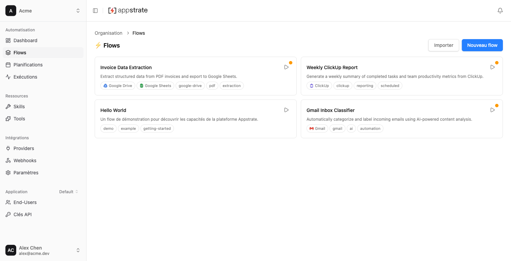

# Appstrate

An open-source platform for executing one-shot AI flows in ephemeral Docker containers. Users sign up, connect OAuth/API key services (Gmail, ClickUp, etc.), click "Run", and the AI agent processes their data autonomously inside a temporary container.




## Features

- **One-shot AI flows** — Each execution runs in an isolated Docker container with a Pi Coding Agent
- **OAuth2 + API key connections** — Connect external services (OAuth2/PKCE, OAuth 1.0a, API key, basic auth, custom credentials)
- **Ephemeral execution** — Containers are created, run, and destroyed per execution
- **Sidecar isolation** — Credential injection via a sidecar proxy (agent never sees raw credentials)
- **Cron scheduling** — Schedule flows with cron expressions, distributed lock prevents duplicates
- **Package import** — Import flows, skills, extensions, and providers from ZIP/AFPS files
- **Skills & extensions** — Extend agent capabilities with SKILL.md instructions and TypeScript tool extensions
- **Realtime** — SSE-based execution monitoring with LISTEN/NOTIFY
- **Multi-tenant** — Organization-based isolation with role-based access (owner/admin/member)
- **API keys** — Programmatic access via `ask_*` prefixed API keys
- **OpenAPI documentation** — 160 endpoints documented at `/api/openapi.json` + Swagger UI at `/api/docs`
- **Connection profiles** — Share connection sets across flows
- **Proxy system** — Org-level and flow-level outbound HTTP proxy support

## Quick Start

```sh
# 1. Start infrastructure
docker compose up -d          # PostgreSQL 16

# 2. Run database migrations
bun run db:generate           # Generate Drizzle migrations from schema
bun run db:migrate            # Apply migrations to PostgreSQL

# 3. Build runtime images
bun run build-runtime         # docker build -t appstrate-pi ./runtime-pi
bun run build-sidecar         # docker build -t appstrate-sidecar ./runtime-pi/sidecar

# 4. Configure .env (copy .env.example, set LLM API keys + DB URL + Better Auth secret)

# 5. Build everything (shared-types + frontend)
bun run build                 # turbo build → apps/web/dist/

# 6. Start platform
bun run dev                   # turbo dev → Hono on :3000

# 7. First signup creates an organization automatically
```

## Project Structure

```
appstrate/
├── apps/
│   ├── api/src/              # Hono API server (:3000)
│   │   ├── routes/           # Route handlers (one file per domain)
│   │   ├── services/         # Business logic, Docker, adapters, scheduler, marketplace
│   │   ├── openapi/          # OpenAPI 3.1 spec (160 endpoints)
│   │   └── middleware/       # Auth, rate-limit, guards (requireAdmin, requireFlow)
│   │
│   └── web/src/              # React 19 SPA (Vite + React Query v5 + Zustand)
│       ├── pages/            # Route pages (React Router v7)
│       ├── hooks/            # React Query + SSE realtime hooks
│       ├── components/       # UI components (modals, forms, editors)
│       └── stores/           # Zustand stores (auth, org, profile)
│
├── packages/
│   ├── db/                   # @appstrate/db — Drizzle ORM (30 tables, 6 enums) + Better Auth
│   ├── env/                  # @appstrate/env — Zod env validation
│   ├── shared-types/         # @appstrate/shared-types — Drizzle InferSelectModel re-exports
│   └── connect/              # @appstrate/connect — OAuth2/PKCE, API key, credential encryption
│
├── system-packages/           # System package ZIPs (providers, skills, extensions, flows — loaded at boot)
│
├── runtime-pi/               # Docker image: Pi Coding Agent SDK
│   ├── entrypoint.ts         # SDK session → JSON lines on stdout
│   └── sidecar/server.ts     # Credential-isolating HTTP proxy
│
└── scripts/verify-openapi.ts # OpenAPI validation (coverage + structure + lint)
```

**External dependency**: `@appstrate/core` (npm) — manifest schemas, naming helpers, dependency extraction, ZIP parsing, semver, integrity.

## API Overview

The API is organized into 23 route domains with 158 documented endpoints:

| Domain                  | Description                                               |
| ----------------------- | --------------------------------------------------------- |
| **Auth**                | Better Auth email/password + cookie sessions              |
| **Flows**               | Flow CRUD, config, skills/extensions binding, versions    |
| **Executions**          | Run flows, list executions, logs, cancel                  |
| **Realtime**            | SSE streams for execution monitoring                      |
| **Schedules**           | Cron-based flow scheduling                                |
| **Connections**         | OAuth2/API key service connections                        |
| **Connection Profiles** | Shared connection sets across flows                       |
| **Providers**           | Provider package configuration (OAuth2, API key, custom)  |
| **Provider Keys**       | Org-level LLM provider API key management                |
| **Proxies**             | Org-level and flow-level HTTP proxy config                |
| **API Keys**            | Programmatic access tokens (`ask_*`)                      |
| **Packages**            | Organization skills/extensions CRUD, import, publish      |
| **Notifications**       | Execution notification management                         |
| **Organizations**       | Org CRUD, members, invitations                            |
| **Profile**             | User profile management                                   |
| **Invitations**         | Magic link invitation acceptance                          |
| **Share**               | Public share tokens for one-time execution                |
| **Welcome**             | Post-invite profile setup                                 |
| **Internal**            | Container-to-host routes (credentials, execution history) |
| **Meta**                | OpenAPI spec + Swagger UI                                 |
| **Models**              | Org-level LLM model configuration and testing             |
| **Health**              | Health check                                              |

Full interactive docs: `GET /api/docs` (Swagger UI).

## Architecture

```
Browser (React SPA)              Platform (Bun + Hono :3000)
    |                                |
    |-- Login/Signup --------------->|-- Better Auth (cookie session)
    |-- POST /api/flows/:id/run --->|
    |                                |-- Validate → Create execution → Fire-and-forget
    |<-- SSE (realtime) ------------|-- LISTEN/NOTIFY → SSE stream
    |                                |
    |   Docker network (isolated):   |
    |   ┌─────────────────────┐      |
    |   │  Sidecar Container  │      │-- Credential injection proxy
    |   │  Agent Container    │      │-- Pi SDK → JSON lines stdout
    |   └─────────────────────┘      |
```

- **Sidecar pool**: Pre-warmed containers for fast startup
- **Parallel setup**: Sidecar + agent creation run concurrently
- **Credential isolation**: Agent calls sidecar proxy; never sees raw credentials
- **Output validation**: Native LLM schema enforcement + AJV post-validation against output schema

## Environment Variables

Key variables (see `.env.example` for full list):

| Variable                    | Required | Default                                       | Description                                           |
| --------------------------- | -------- | --------------------------------------------- | ----------------------------------------------------- |
| `DATABASE_URL`              | Yes      | —                                             | PostgreSQL connection string                          |
| `BETTER_AUTH_SECRET`        | Yes      | —                                             | Session signing secret                                |
| `CONNECTION_ENCRYPTION_KEY` | Yes      | —                                             | 32 bytes base64, encrypts stored credentials          |
| `EXECUTION_TOKEN_SECRET`    | No       | —                                             | Execution token signing secret                        |
| `APP_URL`                   | No       | `http://localhost:3000`                       | Public URL for OAuth callbacks                        |
| `TRUSTED_ORIGINS`           | No       | `http://localhost:3000,http://localhost:5173` | CORS origins (comma-separated)                        |
| `PORT`                      | No       | `3000`                                        | Server port                                           |
| `DOCKER_SOCKET`             | No       | `/var/run/docker.sock`                        | Docker socket path                                    |
| `PLATFORM_API_URL`          | No       | —                                             | How sidecar reaches host (fallback: `host.docker.internal:{PORT}`) |
| `SYSTEM_PROVIDER_KEYS`      | No       | `[]`                                          | JSON array of system provider keys with nested models |
| `SYSTEM_PROXIES`            | No       | `[]`                                          | JSON array of system proxy definitions                |
| `PROXY_URL`                 | No       | —                                             | Outbound HTTP proxy for sidecar containers            |
| `LOG_LEVEL`                 | No       | `info`                                        | `debug` \| `info` \| `warn` \| `error`                |
| `EXECUTION_ADAPTER`         | No       | `pi`                                          | Adapter type for flow execution                       |
| `SIDECAR_POOL_SIZE`         | No       | `2`                                           | Pre-warmed sidecar containers (0 = disabled)          |
| `S3_BUCKET`                 | Yes      | —                                             | S3 bucket name for storage                            |
| `S3_REGION`                 | Yes      | —                                             | S3 region (e.g. `us-east-1`)                          |
| `S3_ENDPOINT`               | No       | —                                             | Custom S3 endpoint (for MinIO/R2)                     |

## Development

```sh
bun run dev              # Start API + web (turbo)
bun run check            # TypeScript + ESLint + Prettier + OpenAPI validation
bun run verify:openapi   # OpenAPI spec validation only
bun run lint             # ESLint
bun run format           # Prettier
bun run db:generate      # Generate Drizzle migrations from schema
bun run db:migrate       # Apply migrations
bun run build            # Build everything (turbo)
bun run build-runtime    # Build agent Docker image
bun run build-sidecar    # Build sidecar Docker image
```

### Testing

```sh
bun test                          # All tests (~1000), all packages — requires Docker
bun test apps/api/test/unit/      # API unit tests only (fast, no DB)
bun test apps/api/test/           # API unit + integration
bun test runtime-pi/              # Runtime + sidecar tests
```

Test infrastructure (PostgreSQL, Redis, MinIO, DinD) is started automatically by the preload script on first run. Framework: `bun:test`. See `CLAUDE.md` Testing section for conventions and patterns.

## Tech Stack

- **Runtime**: Bun
- **API**: Hono (SSE, middleware, routing)
- **Database**: PostgreSQL 16 + Drizzle ORM
- **Auth**: Better Auth (cookie sessions) + API keys (`ask_*`)
- **Frontend**: React 19 + Vite + React Router v7 + React Query v5 + Zustand
- **Styling**: Tailwind CSS 4 (`@tailwindcss/vite` plugin + `tailwind-merge`, dark theme via `@theme inline`)
- **i18n**: i18next (fr default, en)
- **Docker**: fetch() + unix socket (not dockerode)
- **Scheduling**: croner (in-memory cron with distributed lock)
- **Validation**: AJV (config/input/output), Zod (env), `@appstrate/core` (manifests)
- **Build**: Turborepo + Bun workspaces
- **Code quality**: ESLint + Prettier + OpenAPI lint (`@redocly/openapi-core`)

## Contributing

See [CONTRIBUTING.md](./CONTRIBUTING.md) for development setup, conventions, and pull request process.

## License

[Apache License 2.0](./LICENSE)
