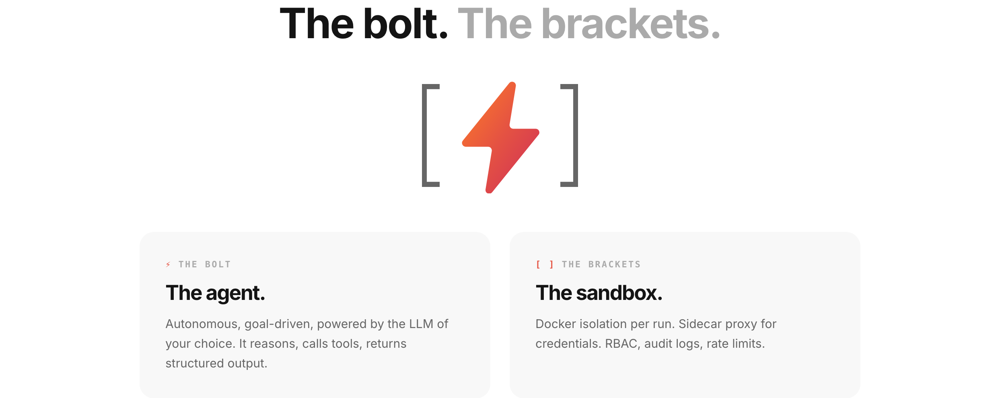

# Appstrate

[](https://github.com/appstrate/appstrate/actions/workflows/test.yml)
[](./LICENSE)
[](https://github.com/appstrate/appstrate/pkgs/container/appstrate)
[](CODE_OF_CONDUCT.md)
[](https://discord.gg/5Js2CKWNnh)

An open-source platform for running autonomous AI agents in sandboxed Docker containers. Each agent receives its full context (prompt, input, credentials) and runs to completion without human interaction — then returns structured results. Connect OAuth/API key services, click "Run" or schedule via cron, and let the AI handle the rest.



## Concepts

Appstrate uses the [AFPS](https://github.com/appstrate/afps-spec) (Agent Format Packaging Standard) packaging model. Everything is a **package** with a manifest, a version, and a scope.

```
                ┌───────────────────────────────┐
  Goal          │  Agent                        │  "What should the AI accomplish?"
                │  prompt.md + manifest.json    │  Runs autonomously in a container.
                ├───────────────────────────────┤
  Capability    │  Skill       (declarative)    │  Reusable instructions (SKILL.md).
                │  MCP server  (executable)     │  Packaged MCP Bundle exposing tools.
                ├───────────────────────────────┤
  Connection    │  Integration                  │  OAuth 2.0, API key, basic, mTLS,
                │                               │  or custom auth for external services.
                └───────────────────────────────┘
```

- An **agent** is the primary unit. It declares a goal (`prompt.md`), its dependencies (skills, mcp-servers, integrations), and its input/output schemas. There is no separate `config` schema: migration `0040_config_into_input` folded that second parameter namespace into `input`, leaving one. Each run creates a fresh Docker container, injects the prompt and credentials via a sidecar proxy, and produces a structured result.
- A **skill** adds knowledge — reusable instructions the agent follows during a run (`SKILL.md` + the [Anthropic Agent Skills](https://agentskills.io/) format).
- An **mcp-server** adds runnable tools. A packaged MCP Bundle (MCPB-vocabulary `server` / `tools` / `user_config`) that runs as a subprocess and speaks JSON-RPC. The agent calls its tools through the sidecar. `server.type ∈ { node, python, binary, uv }` with an optional `_meta["dev.appstrate/mcp-server"].runtime: "bun"` override for Bun-native servers.
- An **integration** adds authenticated access to an external service. Declares a `source` (local mcp-server, remote MCP endpoint, or HTTP API), one or more `auths` methods, and `delivery` for credential injection. Supports OAuth 2.0 (with RFC 8414 discovery + RFC 8707 resource indicators + PKCE), API key, basic auth, mTLS, and custom credential flows.

Agents are **prompt-driven**: the AI coding agent inside the container interprets the goal and writes its own execution code. Change the prompt, change the behavior — no node graphs, no pre-scripted steps.

## Features

- **Autonomous AI agents** — Each run executes in an isolated Docker container with a Pi Coding Agent
- **Flexible authentication** — Connect external services with OAuth 2.0 (RFC 8414 discovery + RFC 8707 resource indicators + PKCE), API key, basic auth, mTLS, and custom credential flows
- **Sandboxed runs** — Containers are created, run, and destroyed per run
- **Hardware-isolated execution** (opt-in) — Run each agent in a dedicated [Firecracker](https://firecracker-microvm.github.io/) microVM for a KVM hardware boundary around the whole run, instead of a shared-kernel container. A workload escape compromises a throwaway guest kernel, not the host. See [Firecracker architecture](./docs/architecture/FIRECRACKER.md)
- **Sidecar isolation** — Credential injection via a sidecar proxy (agent never sees raw credentials)
- **Cron scheduling** — Schedule agents with cron expressions, distributed lock prevents duplicates
- **Package import** — Import agents, skills, MCP servers, and integrations from ZIP/AFPS files
- **Skills & MCP servers** — Extend agent capabilities with SKILL.md instructions and packaged MCP Bundles (`server.type ∈ node | python | binary | uv`)
- **Realtime** — SSE-based run monitoring with LISTEN/NOTIFY
- **Multi-tenant** — Organization-based isolation with role-based access (owner/admin/member)
- **API keys** — Programmatic access via `ask_*` prefixed API keys
- **OpenAPI documentation** — every endpoint documented at `/api/openapi.json` + Swagger UI at `/api/docs` (coverage enforced by `bun run verify:openapi`)
- **Connection profiles** — Share connection sets across agents
- **Proxy system** — Org-level and agent-level outbound HTTP proxy support

## Self-Hosting

Deploy Appstrate with a single command. The installer drops the `appstrate` CLI on PATH and runs `install --yes`, which picks a [tier](#progressive-infrastructure) based on what's available on the host — Tier 2 (PostgreSQL + Redis, filesystem storage) when Docker is reachable, Tier 0 (embedded Bun-only install) otherwise.

```sh
curl -fsSL https://get.appstrate.dev | bash
```

The CLI installs into `~/.local/bin` (no sudo) and adds it to your `PATH`. For a system-wide install, prefix with `APPSTRATE_BIN_DIR=/usr/local/bin` (sudo will be requested). To skip the shell profile modification, set `APPSTRATE_NO_MODIFY_PATH=1`.

Once the tier is chosen, the CLI generates cryptographic secrets, writes `.env` + `docker-compose.yml` (Tiers 1/2/3) or clones the source + spawns `bun run dev` (Tier 0), waits for the healthcheck, and opens [http://localhost:3000](http://localhost:3000).

**Customize the non-interactive install** by forwarding flags through bash:

```sh
curl -fsSL https://get.appstrate.dev | bash -s -- --tier 1 --dir ~/apps/appstrate --port 4000
```

`--tier`, `--dir`, and `--port` override the smart defaults. Equivalent env vars: `APPSTRATE_YES=1`, `APPSTRATE_PORT`, `APPSTRATE_BIN_DIR`.

**Deploying on a remote host behind a reverse proxy?** Pass the public URL so OAuth redirects, CORS, and email links point at the right origin (`TRUST_PROXY` is enabled automatically for non-localhost URLs):

```sh
curl -fsSL https://get.appstrate.dev | bash -s -- --yes --app-url https://appstrate.example.com
```

Also honored via `APPSTRATE_APP_URL`. The installer does **not** provision the reverse proxy or TLS -- point your proxy (Caddy, nginx, Traefik) at `localhost:<port>` yourself; see [`examples/self-hosting/README.md`](./examples/self-hosting/README.md#production-considerations).

**Want the interactive prompts?** Drop the binary without auto-launching, then run `install` yourself:

```sh
curl -fsSL https://get.appstrate.dev | APPSTRATE_NO_LAUNCH=1 bash
appstrate install  # interactive tier + directory prompts
```

See [`apps/cli/README.md`](./apps/cli/README.md) for the full CLI reference, and [`examples/self-hosting/`](./examples/self-hosting/) for manual Docker Compose setup.

## Control from coding agents

The `appstrate` CLI is a first-class control plane for AI coding agents — Claude Code, Cursor, Codex, Gemini CLI, etc. Agents never see a raw bearer: the CLI injects `Authorization: Bearer …` + `X-Org-Id` from the OS keyring on every call, and the OpenAPI schema is explorable at human scale so the agent can discover endpoints on demand instead of flooding its context with the full spec.

```sh
# 1. Authenticate once — RFC 8628 device flow, tokens land in the OS keyring
appstrate login --instance https://app.example.com

# 2. Discover the API — filter, search, render as JSON for the agent to ingest
appstrate openapi list --tag runs --json
appstrate openapi show createRun --json      # fully dereferenced operation

# 3. Call the API — curl-compatible, bearer stays in the keyring
appstrate api POST /api/agents/@acme/my-agent/run -d @input.json

# 4. Scope to an org (auto-pinned on login when possible)
appstrate org switch acme                     # X-Org-Id sent on every subsequent call
```

Full recipe and flag reference: [`apps/cli/AGENTS.md`](./apps/cli/AGENTS.md). See [`apps/cli/README.md`](./apps/cli/README.md) for the complete CLI documentation, including the full `curl` → `appstrate api` mapping and profile management for multi-instance setups.

## Quick Start (Development)

Prerequisites: [Bun](https://bun.sh/) (v1.3+). Docker is optional.

```sh
git clone https://github.com/appstrate/appstrate.git
cd appstrate
bun install
cp .env.example .env
bun run dev       # → http://localhost:3000
```

No Docker, no PostgreSQL, no Redis — just Bun. Appstrate uses **progressive infrastructure**: it starts with an embedded database (PGlite) and local storage, then scales up to PostgreSQL, Redis, and S3 as you need them.

After signup, the onboarding flow guides you to create your first organization. See [Contributing](./CONTRIBUTING.md) for the full development guide.

### Progressive Infrastructure

Appstrate adapts to your infrastructure. Start minimal and add services as you grow — each tier works both as a development setup and a deployment target for small to medium workloads.

| Tier  | Name            | Prerequisites | Database                | Storage    | Queue     | Execution         | RAM (idle) | RAM per run |
| ----- | --------------- | ------------- | ----------------------- | ---------- | --------- | ----------------- | ---------- | ----------- |
| **0** | **Embedded**    | Bun           | PGlite (embedded)       | Filesystem | In-memory | Bun subprocess    | ~300 MB    | +50-100 MB  |
| **1** | **Lightweight** | Bun + Docker  | PostgreSQL              | Filesystem | In-memory | Bun subprocess    | ~600 MB    | +50-100 MB  |
| **2** | **Persistent**  | Bun + Docker  | PostgreSQL + Redis      | Filesystem | BullMQ    | Bun subprocess    | ~700 MB    | +50-100 MB  |
| **3** | **Full**        | Bun + Docker  | PostgreSQL + Redis + S3 | S3         | BullMQ    | Docker containers | ~1.5 GB    | +200-300 MB |

Tiers 0-2 run agents as Bun subprocesses — each concurrent run adds ~50-100 MB. On constrained hardware, limit parallel runs accordingly.

**Tier 0** is ideal for personal use, small devices (Raspberry Pi 4+, NAS), or getting started with zero dependencies. **Tiers 1-2** suit small teams and constrained servers. **Tier 3** is for production with full container isolation.

> **Stronger isolation for untrusted workloads?** The execution backend is pluggable. Beyond the built-in Bun-subprocess and Docker-container backends, an opt-in **Firecracker** backend (`RUN_ADAPTER=firecracker`) runs each agent in a dedicated microVM behind a KVM hardware boundary — the standard control-plane / host-daemon split used by AWS, Fly.io, and E2B. It ships as a built-in module (not in the default `MODULES` set, zero footprint when absent) and requires a KVM host running the `appstrate-runner` daemon. See [Firecracker architecture](./docs/architecture/FIRECRACKER.md).

> **Raspberry Pi**: Bun supports ARM64 natively. A Raspberry Pi 4 (4 GB) handles Tiers 0-1 with 2-3 concurrent runs. A Pi 5 (8 GB) can run Tier 2 comfortably or Tier 3 with sequential runs.

**Tier 0** is the default — `bun run dev` works immediately after install. To scale up:

```sh
# Tier 1: add PostgreSQL (persistent data, multi-user)
bun run docker:dev:minimal    # starts PostgreSQL
# → uncomment DATABASE_URL in .env

# Tier 2: add Redis (persistent scheduling, multi-instance)
bun run docker:dev:standard   # starts PostgreSQL + Redis
# → uncomment DATABASE_URL + REDIS_URL in .env

# Tier 3: full production stack
bun run docker:dev            # starts PostgreSQL + Redis + MinIO
# → uncomment DATABASE_URL + REDIS_URL + S3_BUCKET in .env
```

<details>
<summary>Full setup with Docker (Tier 3)</summary>

```sh
bun install
bun run setup     # copies .env, starts all Docker services, runs migrations, builds frontend
bun run dev       # → http://localhost:3000
```

</details>

## Project Structure

```
appstrate/
├── apps/
│   ├── api/src/              # Hono API server (:3000)
│   │   ├── routes/           # Route handlers (one file per domain)
│   │   ├── modules/          # Built-in modules — routes + RBAC, no owned schemas; see modules/README.md
│   │   ├── services/         # Business logic, Docker, adapters, scheduler
│   │   ├── openapi/          # OpenAPI 3.1 spec — source of truth for every endpoint
│   │   └── middleware/       # Auth, rate-limit, guards (requirePermission, requireAgent)
│   │
│   ├── cli/                  # @appstrate/cli — channel-aware install + self-update + doctor
│   │
│   └── web/src/              # React 19 SPA (Vite + React Query v5 + Zustand)
│       ├── pages/            # Route pages (React Router v7)
│       ├── hooks/            # React Query + SSE realtime hooks
│       ├── components/       # UI components (modals, forms, editors)
│       └── stores/           # Zustand stores (auth, org, space, sidebar, theme)
│
├── packages/
│   ├── core/                 # @appstrate/core — shared validation, storage, utilities (published on npm)
│   ├── afps-shared/          # @appstrate/afps-shared — zero-internal-dep leaf consumed by core (published on npm)
│   ├── ui/                   # @appstrate/ui — React components (schema-form, widgets)
│   ├── afps-runtime/         # @appstrate/afps-runtime — portable AFPS bundle runner + signing + conformance
│   ├── runner-pi/            # @appstrate/runner-pi — Pi run driver + container/sidecar env construction
│   ├── mcp-transport/        # @appstrate/mcp-transport — MCP SDK adapter (sidecar tools surface)
│   ├── db/                   # @appstrate/db — Drizzle ORM + Better Auth (all tables, incl. module-read ones)
│   ├── emails/               # @appstrate/emails — email template registry + cloud override
│   ├── env/                  # @appstrate/env — Zod env validation
│   ├── shared-types/         # @appstrate/shared-types — Drizzle InferSelectModel re-exports
│   ├── module-*/             # opt-in workspace modules (chat, claude-code, codex, observability)
│   └── connect/              # @appstrate/connect — OAuth2/PKCE, API key, credential encryption (v1 envelope + multi-key keyring)
│
├── system-packages/           # System package `.afps` archives — integrations + one mcp-server, loaded at boot
│
├── runtime-pi/               # Docker image: Pi Coding Agent SDK
│   ├── entrypoint.ts         # SDK session → HMAC-signed CloudEvents to platform sink
│   ├── runners/              # Per-runtime MCP runner images (node, bun, python, uv, binary)
│   └── sidecar/server.ts     # Credential-isolating MCP server — first-party tools (run_history, recall_memory) + per-integration {ns}__api_call (+ optional {ns}__api_upload)
│
└── scripts/verify-openapi.ts # OpenAPI validation (coverage + structure + lint + Zod ↔ spec + Code ⊆ Spec)
```

## API Overview

The API is organized into 30+ route domains. The live endpoint count is whatever `bun run verify:openapi` reports — it is deliberately not repeated here:

| Domain                  | Description                                                                                                                     |
| ----------------------- | ------------------------------------------------------------------------------------------------------------------------------- |
| **Auth**                | Better Auth email/password + cookie sessions                                                                                    |
| **Agents**              | Agent CRUD, input settings, skills/mcp-servers/integrations binding, versions, bundle export                                    |
| **Runs**                | Run agents, list runs, logs, cancel, remote run minting + HMAC event ingestion + sink TTL extension                             |
| **Realtime**            | SSE streams for run monitoring (with `Last-Event-ID` resume)                                                                    |
| **Schedules**           | Cron-based agent scheduling                                                                                                     |
| **Connections**         | OAuth 2.0 / API key / basic / mTLS / custom service connections                                                                 |
| **Connection Profiles** | Shared connection sets across agents                                                                                            |
| **Integrations**        | Integration package configuration (OAuth 2.0 + discovery, API key, basic, mTLS, custom; `source.kind = local \| remote \| api`) |
| **Model Provider Keys** | Org-level LLM model provider API key management (OpenAI, Anthropic, etc.) — distinct from AFPS integrations                     |
| **Proxies**             | Org-level and agent-level HTTP proxy config                                                                                     |
| **API Keys**            | Programmatic access tokens (`ask_*`)                                                                                            |
| **Packages**            | Org packages CRUD, import (incl. `.afps-bundle` multi-package), publish, dist-tags, version pinning                             |
| **Library**             | Consolidated package list with per-space install state                                                                          |
| **Notifications**       | Run notification management                                                                                                     |
| **Organizations**       | Org CRUD, members, invitations                                                                                                  |
| **Profile**             | User profile management                                                                                                         |
| **Invitations**         | Magic link invitation acceptance                                                                                                |
| **Welcome**             | Post-invite profile setup                                                                                                       |
| **Internal**            | Container-to-host routes (credentials, run history)                                                                             |
| **Meta**                | OpenAPI spec + Swagger UI                                                                                                       |
| **Models**              | Org-level LLM model configuration and testing                                                                                   |
| **Health**              | Health check                                                                                                                    |
| **Spaces**              | Primary scoping boundary — scopes agents, runs, schedules, webhooks, connections, packages, end-users                           |
| **Space Profiles**      | Space-scoped connection profile management                                                                                      |
| **End-Users**           | External end-user management for headless API (cursor pagination via `startingAfter`/`endingBefore`)                            |
| **Webhooks**            | Run event webhooks with HMAC signing (Standard Webhooks)                                                                        |
| **Credential Proxy**    | Server-side credential injection for external runners (5 verbs: GET/POST/PUT/PATCH/DELETE)                                      |
| **LLM Proxy**           | Server-side LLM model injection — OpenAI + Anthropic protocol families                                                          |
| **OAuth Clients**       | OIDC module — instance/end-user OAuth 2.1 client management                                                                     |
| **CLI Sessions**        | OIDC module — admin oversight of CLI sessions per org (`cli-sessions` RBAC resource)                                            |

### Agent runtime — MCP-only

Agents inside the sandboxed container interact with the platform exclusively through MCP (Model Context Protocol). The sidecar exposes `/mcp` as a Streamable HTTP server; the agent never sees raw credentials, the platform API URL, or HTTP routes. First-party tools cover platform capabilities; per-integration tools cover outbound service access:

- `run_history({ limit?, fields? })` — past-run metadata via per-run signed token.
- `recall_memory({ query?, limit? })` — search the agent's archive memories written via the `note(content)` built-in runtime tool.
- Per spawned integration the sidecar exposes `{ns}__api_call({ method, target, headers?, body?, responseMode? })` — credentials injected server-side; URLs validated against the integration's `auths.{key}.authorized_uris`. Optional `{ns}__api_upload` when an auth declares `_meta["dev.appstrate/api"].auths.{key}.upload_protocols`.
- Integrations backed by an MCP server (`source.kind = local` or `remote`) additionally surface their own tools under the same `{ns}__{tool}` prefix.

The agent's primary completions are served by the sidecar's `/llm/*` HTTP passthrough route the Pi SDK calls natively; sub-agent flows are handled by spawning a separate run via the platform API. The legacy HTTP `/proxy` and `/run-history` routes have been retired — runners 1.x are not compatible with the current platform. See `packages/mcp-transport/README.md` and `runtime-pi/sidecar/README.md`.

### API Documentation

- **Interactive docs**: `GET /api/docs` — Swagger UI, try endpoints in your browser
- **OpenAPI spec**: `GET /api/openapi.json` — Raw OpenAPI 3.1 specification
- **Validation**: `bun run verify:openapi` — Structural + lint checks (0 errors/warnings required)

## Architecture

```
Browser (React SPA)              Platform (Bun + Hono :3000)
    |                                |
    |-- Login/Signup --------------->|-- Better Auth (cookie session)
    |-- POST /api/agents/{scope}/{name}/run -->|
    |                                |-- Validate → Create run → Fire-and-forget
    |<-- SSE (realtime) ------------|-- LISTEN/NOTIFY → SSE stream
    |                                |
    |   Docker network (isolated):   |
    |   ┌─────────────────────┐      |
    |   │  Sidecar Container  │      │-- Credential injection proxy
    |   │  Agent Container    │      │-- Pi SDK → JSON lines stdout
    |   └─────────────────────┘      |
```

- **Image pre-pull**: runtime images are pulled at orchestrator init so the first run doesn't pay the cold pull
- **Parallel setup**: Sidecar + agent creation run concurrently
- **Credential isolation**: Agent calls sidecar proxy; never sees raw credentials
- **Output validation**: Native LLM schema enforcement + AJV post-validation against output schema

Deeper design notes — the [Firecracker microVM backend](./docs/architecture/FIRECRACKER.md), [sidecar protocol](./docs/architecture/SIDECAR.md), integrations runtime, run-cost tracking, and more — live in [`docs/architecture/`](./docs/architecture/README.md).

## Environment Variables

There is **one** authoritative list, and it is not this file: the Zod schema in
[`packages/env/src/index.ts`](./packages/env/src/index.ts). It defines every
variable, its default, and its validation — and it fails fast at boot. Three
places consume it, none of them duplicate it:

| Where                            | What it gives you                                                                                                                                           |
| -------------------------------- | ----------------------------------------------------------------------------------------------------------------------------------------------------------- |
| `packages/env/src/index.ts`      | **Source of truth.** Names, defaults, refinements, cross-field rules.                                                                                       |
| [`docs/ENV.md`](./docs/ENV.md)   | Prose reference — one annotated row per variable, plus the few sidecar/module vars read directly from `process.env` (and therefore absent from the schema). |
| [`.env.example`](./.env.example) | Copy-paste operator contract with dev-ready values.                                                                                                         |

Self-hosting? [`examples/self-hosting/.env.example`](./examples/self-hosting/.env.example)
is the production-shaped variant, and
[`examples/self-hosting/README.md`](./examples/self-hosting/README.md) explains the
deployment-specific ones.

**Required — the platform refuses to boot without them:**

| Variable                    | Notes                                                                    |
| --------------------------- | ------------------------------------------------------------------------ |
| `BETTER_AUTH_SECRET`        | Session signing secret                                                   |
| `CONNECTION_ENCRYPTION_KEY` | 32 bytes base64 — primary key for the v1 credential envelope             |
| `UPLOAD_SIGNING_SECRET`     | HMAC secret for filesystem upload-sink tokens (≥16 chars per key)        |
| `RUN_TOKEN_SECRET`          | HMAC secret for run bearer tokens (≥16 chars per key)                    |
| `CONNECT_SESSION_SECRET`    | HMAC secret for hosted-connect-portal session tokens (≥16 chars per key) |

The installer (`curl -fsSL https://get.appstrate.dev | bash`) generates all five.

## Development

```sh
bun run setup            # One-command dev bootstrap (first time only)
bun run dev              # Start API + web (turbo, hot-reload)
bun run check            # The full quality gate — 18 tasks, listed in CLAUDE.md
bun test                 # All tests — requires Docker
bun run db:generate      # Generate Drizzle migrations from schema changes
bun run db:migrate       # Apply migrations manually (boot applies them automatically)
bun run build            # Build everything (turbo)
bun run build-runtime    # Rebuild the runtime image PAIR — appstrate-pi + appstrate-sidecar
                         # (only if you modify runtime-pi/; the two are a version contract
                         #  and are never built one at a time)
```

### Testing

```sh
bun test                          # All tests, all packages — requires Docker
bun test apps/api/test/unit/      # API unit tests only (fast, no DB)
bun test apps/api/test/           # API unit + integration
bun test runtime-pi/              # Runtime + sidecar tests
```

Test infrastructure (PostgreSQL, Redis, MinIO, DinD) is started automatically by the preload script on first run. Framework: `bun:test`. See `CLAUDE.md` Testing section for conventions and patterns.

## Tech Stack

- **Runtime**: Bun
- **API**: Hono (SSE, middleware, routing)
- **Database**: PostgreSQL 16 + Drizzle ORM
- **Auth**: Better Auth (cookie sessions) + API keys (`ask_*`)
- **Frontend**: React 19 + Vite + React Router v7 + React Query v5 + Zustand
- **Styling**: Tailwind CSS 4 (`@tailwindcss/vite` plugin + `tailwind-merge`, dark theme via `@theme inline`)
- **i18n**: i18next (fr default, en)
- **Docker**: fetch() + unix socket (not dockerode)
- **Scheduling**: BullMQ (Redis-backed distributed cron) + cron-parser
- **Validation**: Zod 4 everywhere — every route request body is validated with `.safeParse()`, and `@appstrate/env` validates the environment. AJV is used only for the dynamic JSON Schemas an agent manifest declares (input/output)
- **Build**: Turborepo + Bun workspaces
- **Code quality**: ESLint + Prettier + OpenAPI lint (`@redocly/openapi-core`)

## FAQ

**Can I self-host Appstrate?**
Yes. Run `curl -fsSL https://get.appstrate.dev | bash` to install with automatic secret generation and Docker Compose setup. See [Self-Hosting](#self-hosting) and [`examples/self-hosting/`](./examples/self-hosting/) for configuration.

**What LLM providers are supported?**
Any provider compatible with the Pi Coding Agent SDK. Configure via `SYSTEM_PROVIDER_KEYS` or the org-level model settings UI.

**How is this different from workflow automation tools?**
Appstrate runs autonomous AI agents in isolated containers, not predefined step-by-step workflows. Each agent is prompt-driven — the agent decides how to process data.

**Is this production-ready?**
The platform is actively used in production. See [SECURITY.md](./SECURITY.md) for the threat model and defense layers, and [CHANGELOG.md](./CHANGELOG.md) for release history.

## Community

- 💬 [Discord](https://discord.gg/5Js2CKWNnh) — chat, questions, showcase what you're building
- 🐛 [GitHub Issues](https://github.com/appstrate/appstrate/issues) — bugs, feature requests, and long-form proposals

## Support

- **Bug reports**: [GitHub Issues](https://github.com/appstrate/appstrate/issues)
- **Questions**: [Discord](https://discord.gg/5Js2CKWNnh)
- **Security vulnerabilities**: See [SECURITY.md](./SECURITY.md) for responsible disclosure
- **Developer guide**: See [CLAUDE.md](./CLAUDE.md) for architecture, testing, and conventions
- **Email**: hello@appstrate.dev

## Contributing

See [CONTRIBUTING.md](./CONTRIBUTING.md) for development setup, conventions, and pull request process.

## License

[Apache License 2.0](./LICENSE)
